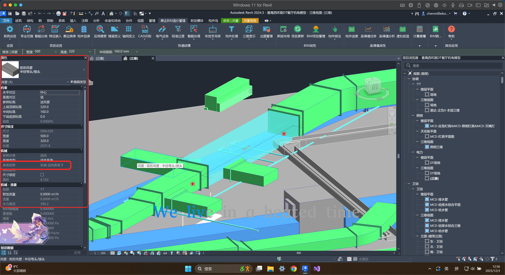

# 讨论准备 - 2025-12-03

> 工程量计算技术实现讨论

**讨论方**: 易达
**日期**: 2025-12-03

---

## 讨论目标

1. 明确本次评审的模块范围
2. 确认工程量计算的技术实现方式
3. 解决第一阶段遗留的技术问题

---

## 待确认问题

### 1. 评审范围确认

**完整业务流程**：

```
插件上传族 → 系统配置品目/清单/工程量 → 建模员下载使用 → 导出BIM数据包 → 系统匹配+计算
```

**涉及模块**：

| 模块 | 位置 | 主要功能 | 依赖关系 |
|------|------|----------|----------|
| 族维护 | Web端 | 接收上传族、配置品目/清单/工程量规则 | 被插件和新增项目依赖 |
| 插件功能 | Revit端 | 上传族、下载族、导出BIM数据包 | 依赖族维护的配置 |
| 新增项目 | Web端 | 导入数据包、执行清单匹配/工程量计算 | 依赖族维护的规则配置 |

**待确认**：
- [x] 本次评审包含上述三个模块中的哪些？ → **三个模块全部在范围内**
- [x] 如果不是全部，未包含的模块预计何时评审？ → 不适用，全部在范围内
- [x] 模块间存在耦合，评审/开发顺序如何安排？ → **12-04 评审**

**补充说明**：清单分类维护需由李工与黄工另行对接确认（复杂，不在本次范围）

---

### 2. 永麦专用插件功能确认

> 注意：本次讨论的是**永麦专用插件**，易达现有的是**通用插件**。

**功能清单**：

| 功能 | 说明 |
|------|------|
| 上传自建族 | 上传 .rfa 文件到系统 |
| 上传系统族 | 提取类型定义数据（层结构、材质、厚度等），以数据形式上传 |
| 下载族 | 从系统族库下载族到本地项目 |
| 导出 BIM 数据包 | 导出项目构件信息（JSON格式） |
| 几何参数提取 | 长、宽、高、面积、体积等 |
| 叠层墙处理 | 分层导出各层材质和厚度 |

**关键技术点**：

| 族类型 | 存储形式 | 上传方式 |
|--------|----------|----------|
| 可载入族 | 独立 .rfa 文件 | 直接上传文件 |
| 系统族 | 内置于项目文件(.rvt) | 提取类型定义数据上传 |

> 系统族（墙、楼板、天花板等）无法导出为独立文件，只能提取其类型定义数据。

**核心问题：专用插件 vs 通用插件**

通用插件已有部分功能实现，永麦专用插件如何处理？

| 方案 | 说明 | 优缺点 |
|------|------|--------|
| 引用 | 专用插件调用通用插件的功能 | 复用代码，但有依赖 |
| 集成 | 将功能重新开发到专用插件中 | 独立可控，但开发量大 |

**待确认**：
- [x] 永麦专用插件与通用插件的关系？ → **独立插件，类似功能从通用插件集成代码**
- [x] 自建族上传：选择本地 .rfa 文件？ → **是，直接选本地 .rfa 文件**
- [x] 系统族上传：类型定义数据需要包含哪些字段？ → **上传 .rvt 文件，选择族，推送到对应品目**
- [x] 下载族的交互流程是怎样的？ → **和通用插件界面类似**
- [x] 插件功能是否需要原型展示？ → 已有原型

**结论**：永麦专用插件 = 独立插件（主体），通用插件已有的类似功能代码集成进来调整使用

---

### 3. 工程量计算

#### 3.1 幕墙工程量计算

> 11-25 讨论时易达提到"工程量计算已有实现"，但这是**通用插件**的实现。

**背景**：
- 通用插件已实现幕墙工程量计算
- 永麦专用插件尚未开发

**待确认**：
- [x] 通用插件的幕墙计算逻辑是怎样的？ → **已实现，代码集成过来即可**
- [x] 是在插件端计算还是服务器端计算？ → **系统端可自定义配置**
- [x] 永麦专用插件如何使用这个能力？ → **集成通用插件代码**

**结论**：
- 插件端：通用插件已实现，代码集成
- 系统端：**可自定义配置化** —— 系统提供所有基础量（幕墙面积、门面积、窗面积等），用户根据项目需要自行配置组合公式（如是否扣除门窗）

---

#### 3.2 跨品目清单匹配（逻辑复查）

> 验证现有清单匹配逻辑是否支持"建模用A族，出B清单"的场景。

**场景举例**：

| 场景 | 建模使用 | 实际清单 | 说明 |
|------|----------|----------|------|
| 卫生间台阶侧边 | 墙 | 地板 | 蹲厕位置高于地面，侧边用墙建模 |
| 天花板高差侧边 | 墙 | 天花板 | 不同高度天花板的侧边用墙建模 |

**我们的理解**：

现有逻辑**可以支持**：
1. 在"墙"品目下配置多条清单匹配规则
2. 新增一条规则：族类型名称 = "台阶侧边墙" → 匹配"地板"清单
3. 新增一条规则：族类型名称 = "天花侧边墙" → 匹配"天花板"清单

```
墙（品目）
├── 清单A: 普通墙 ← 族类型 = "普通内墙"、"普通外墙"...
├── 清单B: 地板   ← 族类型 = "台阶侧边墙"
└── 清单C: 天花板 ← 族类型 = "天花侧边墙"
```

**待确认**：
- [x] 以上理解是否正确？墙品目可以关联地板/天花板清单？ → **是，确认支持**
- [x] 工程量计算是否也能正确跟随清单？ → **是，能正确跟随**

**结论**：跨品目清单匹配确认支持，现有逻辑满足需求

---

#### 3.3 排水管长度计算（变径处理）

> 排水管工程量计算中，弯头和变径的管道长度计算方式确认。

**现状**：

| 管件类型 | CAD传统方式 | 通用插件方式 | 差异 |
|----------|-------------|--------------|------|
| **弯头** | 拉线自动转弯 | 中心线转弯 | 一致，无问题 |
| **变径** | 拉线到变径**侧边（边缘）** | 中心线**平均分配**到两侧管道 | 有误差 |

**变径计算差异图示**：

```
CAD方式（拉到边缘）：
  大管 ──┤变径├── 小管
  大管长度 = 到变径左边缘
  小管长度 = 从变径右边缘开始
  变径 = 单独计量

中心线方式（平均分配）：
  大管 ────╳──── 小管
         中心点
  大管长度 = 到变径中心（多算半个变径长度）
  小管长度 = 从变径中心开始（多算半个变径长度）
  变径长度被"消化"进两侧管道
```

**误差分析**：
- 单个变径误差 ≈ 变径长度的一半（通常几十到一两百毫米）
- 整体系统误差取决于变径数量
- 目前评估：**在可接受范围内**

**待确认**：
- [ ] 通用插件确实是采用中心线平均分配方式？ → **需后续专项梳理**
- [ ] 之前是否讨论过这个问题？有无历史结论？ → **需后续专项梳理**
- [ ] 永麦项目是否沿用现有逻辑？还是需要优化为边缘计算方式？ → **需后续专项梳理**

**可选方案**：

| 方案 | 说明 | 影响 |
|------|------|------|
| 保持现状 | 沿用中心线平均分配 | 误差在可接受范围，无额外开发 |
| 插件端优化 | 识别变径，按边缘计算管道长度 | 需修改插件逻辑 |
| 系统端修正 | 对含变径的管段应用修正系数 | 需配置规则 |

**结论**：⚠️ **需后续专项梳理**

此议题扩展为：**全面梳理所有水管管件的工程量计算规则**

| 管件类型 | 计算逻辑 | 状态 |
|----------|----------|------|
| 直管（双头） | | 待梳理 |
| 弯头 | | 待梳理 |
| 三通 | | 待梳理 |
| 变径 | | 待梳理 |
| 四通 | | 待梳理 |

**后续行动**：
1. Stephen 梳理所有管件情况，形成文档
2. 与薛飘飘交流确认计算规则
3. 如需补充，与造价沟通
4. 输出：《水管工程量计算规则》文档

---

### 4. 风管按"系统名称"细分工程量

> **历史需求**：建模员薛飘飘反馈，TAPD 已提单。当时因通用插件无法定制被搁置，现开发专用插件，正是加入此功能的时机。

#### 4.1 需求背景

风管在 Revit 中有"系统名称"属性（Revit 自动生成），如"机械 送风系统 9"。

**诉求**：在计算风管总工程量的基础上，按不同的"系统名称"进一步细分，生成各系统的工程量清单。


<!-- 截图内容：Revit 属性面板，显示风管的"系统名称"字段（绿框标注） -->

#### 4.2 现状问题

通用插件的"属性分类设置"中，只有"系统类型"，**没有"系统名称"**。


<!-- 截图内容：通用插件的属性分类设置界面，中间属性列设置无"系统名称"，右侧工程量列 -->

**导致的问题**：
- 无法按"系统名称"导出数据
- 无法在系统端按系统名称细分工程量
- 建模员需手动筛选、作差、录入，繁琐易错

#### 4.3 期望效果

在 YDC/YBP 系统的项目结构中，空调系统下的子级能自动关联风管的"系统名称"值：


<!-- 截图内容：YDC 系统项目结构树，空调系统展开显示 VRV单联、VRV多联、FCU系统等子级 -->

```
项目结构                          对应关系
─────────                        ─────────
空调系统                    ←    所有风管工程量总和
├── VRV单联系统            ←    系统名称 = "VRV单联系统" 的风管
├── VRV多联系统            ←    系统名称 = "VRV多联系统" 的风管
├── FCU系统                ←    系统名称 = "FCU系统" 的风管
└── ...
```

#### 4.4 当前流程 vs 期望流程

| 环节 | 当前（手动） | 期望（自动化） |
|------|-------------|----------------|
| 插件导出 | 不含系统名称 | 包含系统名称字段 |
| 数据分组 | 手动筛选 | 自动按系统名称分组 |
| 项目结构 | 手动录入 | 自动关联层级 |
| 工程量 | 手动计算、作差 | 自动生成细分清单 |

#### 4.5 涉及模块

| 模块 | 位置 | 改动点 |
|------|------|--------|
| **插件端** | Revit | 属性列设置增加"系统名称"字段 |
| **数据包** | 插件→系统 | 导出时携带系统名称值 |
| **系统端** | Web | 配置系统名称 ↔ 项目结构层级的映射 |
| **工程量计算** | Web | 支持按系统名称分组汇总 |

#### 4.6 待确认

- [x] 插件端增加"系统名称"字段的开发量评估？ → **不复杂，属性本来就有，加上就行**
- [x] 系统端如何配置系统名称与项目结构的映射关系？ → **配置品目时关联项目结构位置，系统名称值对应子级**
- [ ] 是否有其他类似需要细分的属性？ → **需梳理：风管需要，水管/其他构件待确认**
- [x] 开发优先级和排期？ → 纳入永麦专用插件开发

**结论**：
- 插件端：不复杂，永麦加上即可
- 系统端：品目配置时关联项目结构 → 系统名称自动分组到子级 → 上级汇总
- 待梳理：哪些构件需要"系统名称"细分功能

---

## 背景信息

**第一阶段已确定**：
- 5 种清单匹配方式（无条件、单参数区间、单参数精确、多参数AND、多参数区间联合）
- 4 种工程量计算方式（计数、参数汇总、带系数、跨构件）
- 参数体系分类（几何参数 vs 非几何参数）

**第一阶段遗留问题**：
- 工程量计算的执行位置（插件端 vs 服务器端）
- 规则配置的复杂度边界
- 幕墙等复杂案例的处理方式

---

## 讨论记录

**会议时间**：2025-12-03
**参会人员**：Stephen、李昱、黄增沛、游工

### 议题结论汇总

| 议题 | 状态 | 结论 |
|------|------|------|
| 1. 评审范围 | ✅ | 三个模块全部在范围内，12-04 评审 |
| 2. 插件功能 | ✅ | 独立插件，类似功能集成通用插件代码 |
| 3.1 幕墙工程量 | ✅ | 通用插件已有，系统端可自定义配置组合 |
| 3.2 跨品目清单 | ✅ | 确认支持 |
| 3.3 排水管变径 | ⚠️ | 需后续专项梳理所有管件情况 |
| 4. 系统名称细分 | ✅ | 插件端不难，系统端通过品目配置关联 |

### 补充议题

**人员交接**：
- 12月：Stephen 继续当前工作
- 1月起：李昱全面接管 YBP 系统开发

**清单匹配配置语法**：
- 现状：需书写类似 `(AND([风量]>3000,[风量]<=5000)` 的语法
- 结论：暂定，最终有审核人把关，后续和李昱讨论

---

## 结论与下一步

### Stephen 12月核心任务

**总目标**：全面梳理 YBP 业主清单的工程量计算部分

| 任务 | 说明 | 状态 |
|------|------|------|
| 业主清单梳理 | 麦当劳、奥乐齐清单，分类 Revit 自带 vs 需代码实现 | 待开始 |
| 水管系统专项 | 梳理所有管件（双头、三通、变径等）计算规则 | 待开始 |
| 风管系统专项 | 梳理"系统名称"细分功能应用范围 | 待开始 |
| 其他系统 | 电气、消防等，根据业主清单补充 | 待开始 |

### 协作计划

- 与薛飘飘沟通：建模细节、管件计算方式
- 与造价沟通：计价规则确认
- 12月底前：完成文档整理，准备交接

### 输出物

1. 《水管工程量计算规则》
2. 《系统名称属性应用范围清单》
3. 《业主清单工程量分类表》（麦当劳、奥乐齐）

---

**准备人**: Stephen
**创建日期**: 2025-12-02
**更新日期**: 2025-12-03（补充讨论结论）
